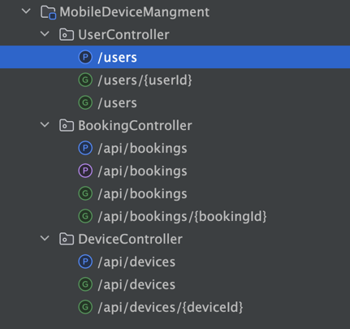
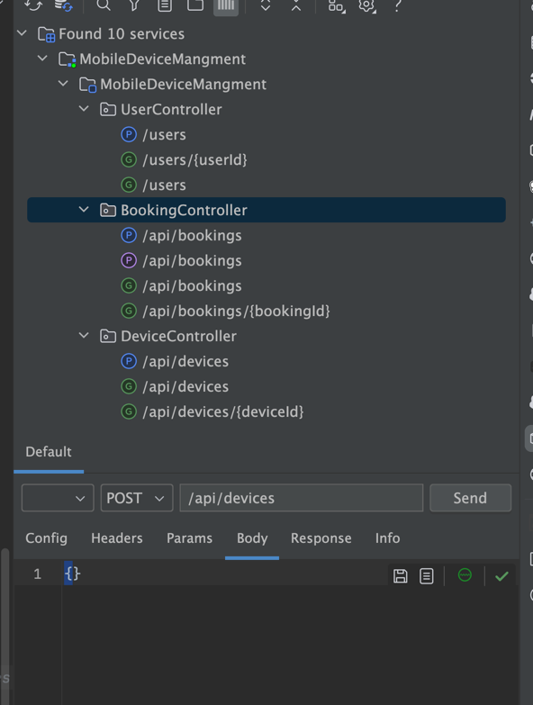

# MobileDeviceManagement System
This application is develop to book the mobile device for testing purpose

## Purposed Features
This is a web based java application build using spring boot
It provides rest endpoint to add users, devices and book the device for testing purpose

* #### Users Controller 
  * this rest controller provide to register the users with system
* #### Device controller
  * this rest controller provide endpoint to add new devices and retrieve existing devices in system
* #### Booking Controller
  * this rest controller provides endpoint to book, return, get all available devices

## Non-Functional Requirements
* Security can be added and authorization on different end point can be added to make it more secure
* Swagger can be added for better documentation of the endpoints

### Tech stack
#### Spring Boot with Java
#### PostgresSQL for database
#### Docker 
* container with compose for testing

### Device Controller expose 3 endpoints
* Add device **(POST)**
* Get All device **(GET)**
* Get device by device id **(GET)**
### Booking Controller exposes 4 endpoints
* Create new booking for device **(POST)**
* Update device booking status **(Patch)**
* Get booking details by booking id **(GET)**
* Get All device which are available **(GET)**
### User Controller exposes 3 endpoints
* Add new user **(POST)**
* Get user details by id **(GET)**
* Get all users details **(GET)**

``### Add the device
#### POST:http://localhost:8080/api/device
**Json-Body**
###############################

`{
"modelName": "Apple iPhone 13",
"platform": "IOS",
"brand": "Apple",
"osVersion": 12
}`

###############################
## book the device
#### POST:http://localhost:8080/api/bookings
**Json-Body**
###############################

`{
"userId": 1,
"deviceId": 2,
"bookingDurationDays": 2
}`

###############################
### Return device
#### PATCH:http://localhost:8080/api/bookings/:bookingId
**Json-Body**
###############################

`{
"status":"Returned"
}
`
###############################

#### POST:http://localhost:8080/users
**Json-Body**
###############################

`{
"employeeId": "12323",
"name": "Test",
"email": "t@test.com",
"role": "Tester"
}`
`public enum Role {
Tester,
Developer,
Manager,
Admin
}`
################################``

## How to test?
* Restful box intelliJ plugin can be used for testing as shown in image
* Bring docker-compose up for both db and application
* Once both are up, use init.sql either via psql or dbeaver and insert the device record
* Using user api, add new user
* Creating booking of device using booking endpoint request body is shared.

